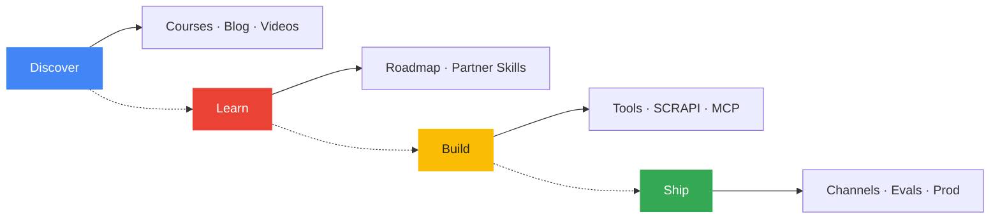
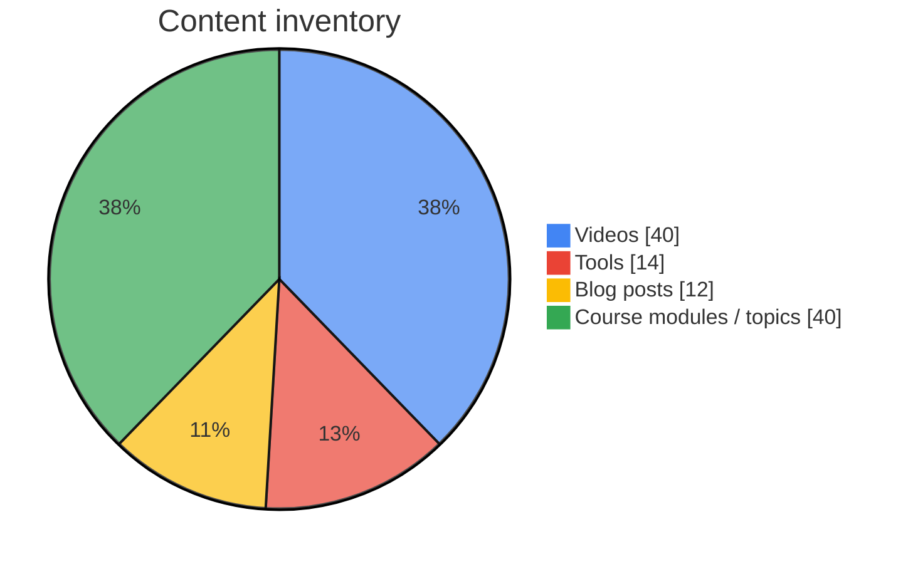
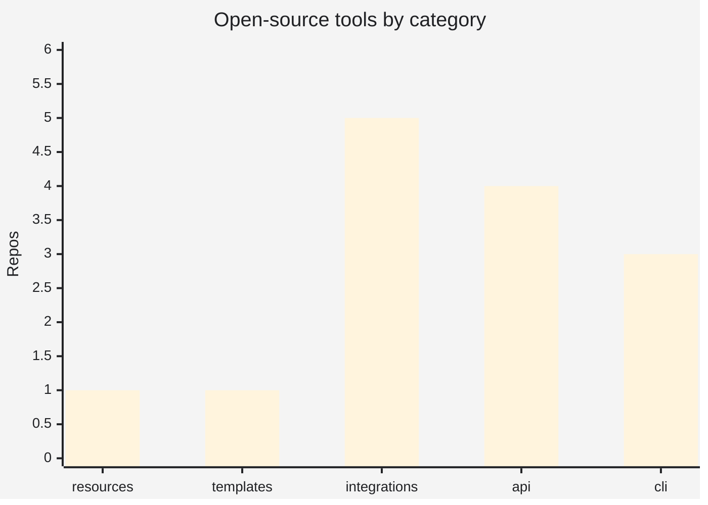
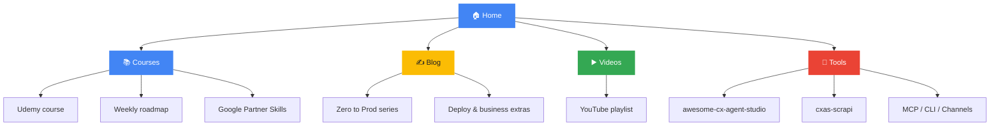
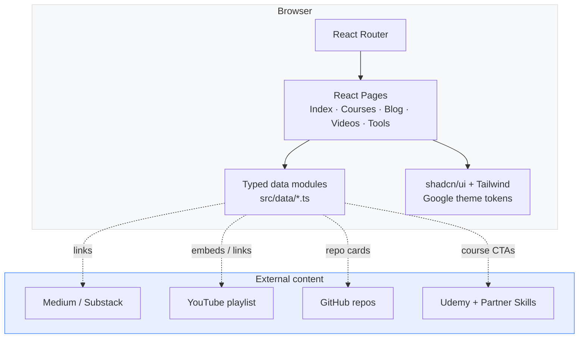
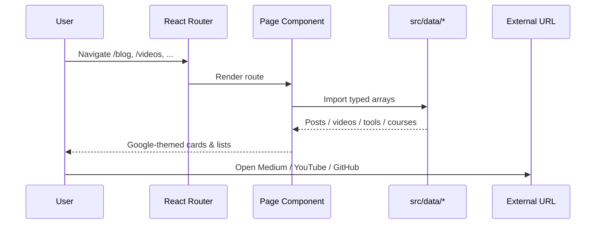
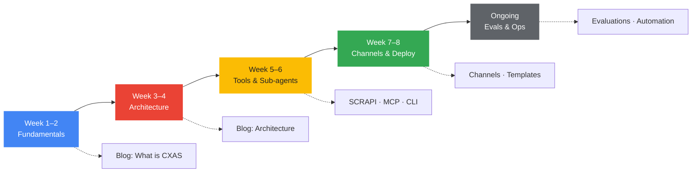
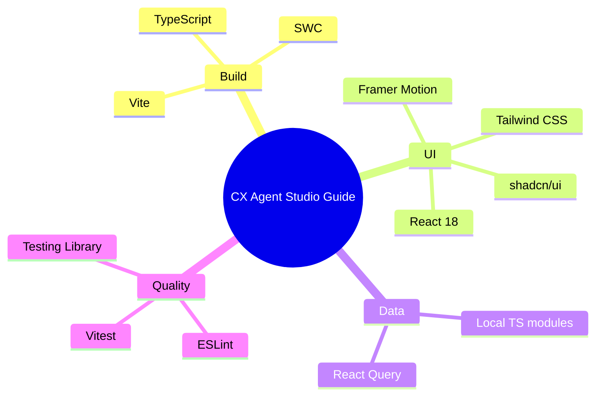
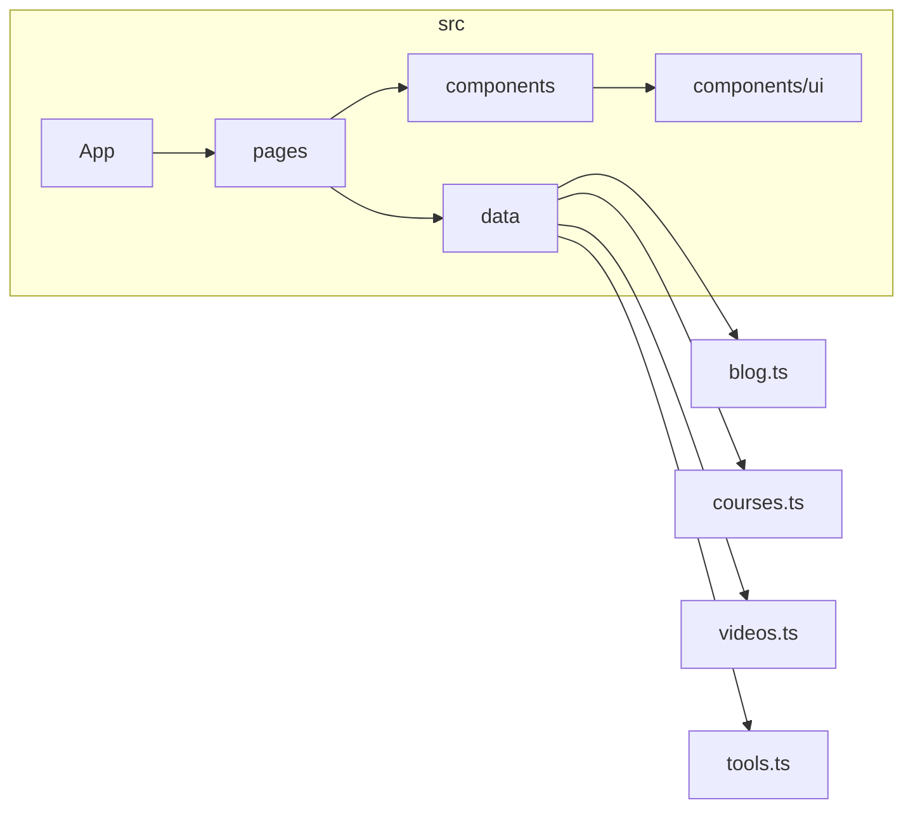
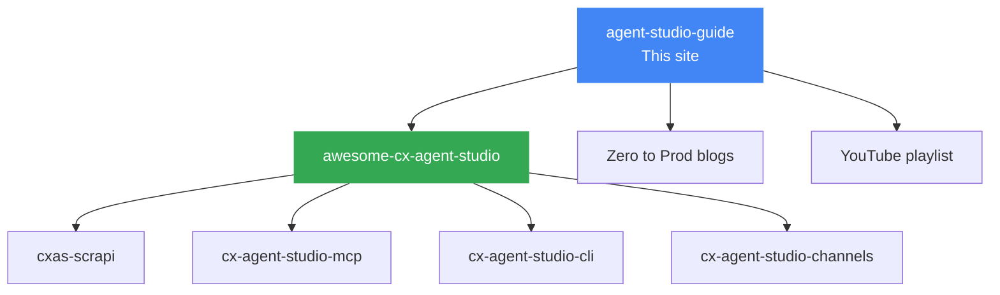

# CX Agent Studio Guide

[](https://cxagentstudio.lovable.app)
[](https://github.com/Yash-Kavaiya/agent-studio-guide)
[](https://github.com/Yash-Kavaiya/awesome-cx-agent-studio)
[](https://youtube.com/playlist?list=PLOAciEalMV3GGRZD2RJ7mjOEcI4DXQs0j)
[](https://medium.com/@yashkavaiya/list/cx-agent-studio-zero-to-prod-blog-series-fab5fd825601)

> The learning hub for **Google CX Agent Studio** — courses, blogs, videos, and open-source tools in one Google-themed React app.

**Live site:** [cxagentstudio.lovable.app](https://cxagentstudio.lovable.app)

---

## Table of Contents

- [Overview](#overview)
- [Content at a Glance](#content-at-a-glance)
- [Architecture](#architecture)
- [Learning Path](#learning-path)
- [Features](#features)
- [Tech Stack](#tech-stack)
- [Project Structure](#project-structure)
- [Getting Started](#getting-started)
- [Available Scripts](#available-scripts)
- [Related Resources](#related-resources)
- [Contributing](#contributing)

---

## Overview

CX Agent Studio Guide is a Vite + React + TypeScript site that organizes everything you need to go from **zero → production** with Google’s multimodal customer-experience agents:

| Area | What you get |
| --- | --- |
| **Courses** | Udemy course + multi-week roadmap + Google Partner Skills |
| **Blog** | Zero to Prod series (Medium) + Substack extras |
| **Videos** | Full YouTube playlist (labs, demos, 30-day series, SCRAPI) |
| **Tools** | Curated open-source repos (CLI, MCP, channels, evals, templates) |



---

## Content at a Glance

Snapshot of curated content currently shipped in the app:

| Resource | Count |
| --- | ---: |
| Blog posts | **12** |
| YouTube videos | **40** |
| Open-source tools | **14** |
| Course / roadmap topics | **40+** |



### Tool categories



### How learners use the site



---

## Architecture

High-level app architecture:



### Data → page flow



---

## Learning Path

Suggested path from first agent to production:



---

## Features

- **Google-themed UI** — Roboto typography, Material-style cards, four-color brand bar
- **Courses & roadmap** — Udemy deep dive plus a structured weekly learning path
- **Blog hub** — Zero to Prod Medium series + Substack articles
- **Video library** — Playlist-backed tutorials, labs, shorts, and SCRAPI deep dives
- **Tools catalog** — Templates, APIs, MCP servers, CLI, and channel connectors
- **Client-side routing** — Fast SPA navigation with React Router
- **Accessible UI kit** — shadcn/ui + Radix primitives
- **Motion** — Framer Motion for intentional section reveals
- **Tests** — Vitest + Testing Library

---

## Tech Stack



| Layer | Choice |
| --- | --- |
| Bundler | [Vite](https://vitejs.dev/) |
| UI | [React](https://react.dev/) + TypeScript |
| Styling | [Tailwind CSS](https://tailwindcss.com/) + [shadcn/ui](https://ui.shadcn.com/) |
| Routing | [React Router](https://reactrouter.com/) |
| Charts / motion | [Recharts](https://recharts.org/) · [Framer Motion](https://www.framer.com/motion/) |
| Tests | [Vitest](https://vitest.dev/) · Testing Library |

---

## Project Structure

```text
agent-studio-guide/
├── public/                 Static assets
├── scripts/                Maintenance / sync helpers
├── src/
│   ├── components/         Layout, Navbar, Footer, GoogleColorBar
│   │   └── ui/             shadcn/ui primitives
│   ├── data/               Content sources
│   │   ├── blog.ts
│   │   ├── courses.ts
│   │   ├── tools.ts
│   │   └── videos.ts
│   ├── hooks/              Shared React hooks
│   ├── lib/                Utilities (cn, etc.)
│   ├── pages/              Route pages
│   │   ├── Index.tsx
│   │   ├── Courses.tsx
│   │   ├── Blog.tsx
│   │   ├── BlogPost.tsx
│   │   ├── Videos.tsx
│   │   ├── Tools.tsx
│   │   └── NotFound.tsx
│   ├── App.tsx             Router + providers
│   ├── index.css           Design tokens (Google theme)
│   └── main.tsx
├── index.html
├── package.json
├── tailwind.config.ts
├── vite.config.ts
└── vitest.config.ts
```



---

## Getting Started

### Prerequisites

- **Node.js 18+**
- npm (bundled with Node)

### Install & run

```sh
git clone https://github.com/Yash-Kavaiya/agent-studio-guide.git
cd agent-studio-guide
npm install
npm run dev
```

Open the URL Vite prints (usually `http://localhost:5173/`).

### Production build

```sh
npm run build
npm run preview
```

Static output lands in `dist/` — deploy to any static host (Lovable, GitHub Pages, Cloudflare Pages, Netlify, etc.).

---

## Available Scripts

| Command | Description |
| --- | --- |
| `npm run dev` | Start Vite dev server |
| `npm run build` | Production build → `dist/` |
| `npm run build:dev` | Build in Vite development mode |
| `npm run preview` | Preview production build locally |
| `npm run lint` | Run ESLint |
| `npm run test` | Run Vitest once |
| `npm run test:watch` | Vitest watch mode |

### Pre-PR checklist

```sh
npm run lint
npm run test
npm run build
```

---

## Related Resources

| Resource | Link |
| --- | --- |
| Live guide | [cxagentstudio.lovable.app](https://cxagentstudio.lovable.app) |
| Awesome list | [awesome-cx-agent-studio](https://github.com/Yash-Kavaiya/awesome-cx-agent-studio) |
| Zero to Prod blogs | [Medium series](https://medium.com/@yashkavaiya/list/cx-agent-studio-zero-to-prod-blog-series-fab5fd825601) |
| YouTube playlist | [CX Agent Studio videos](https://youtube.com/playlist?list=PLOAciEalMV3GGRZD2RJ7mjOEcI4DXQs0j) |
| Official docs | [Google Cloud CX Agent Studio](https://docs.cloud.google.com/customer-engagement-ai/conversational-agents/ps) |
| Console | [ces.cloud.google.com](https://ces.cloud.google.com) |
| SCRAPI | [GoogleCloudPlatform/cxas-scrapi](https://github.com/GoogleCloudPlatform/cxas-scrapi) |
| Community | [r/CXAgentStudio](https://www.reddit.com/r/CXAgentStudio/) |
| Mentorship | [topmate.io/yash_kavaiya](https://topmate.io/yash_kavaiya) |



---

## Contributing

1. Fork the repo and create a feature branch.
2. Keep content typed in `src/data/*` — prefer data updates over hard-coded page markup.
3. Match the Google theme tokens in `src/index.css` / Tailwind config.
4. Run lint, tests, and build before opening a PR.

---

## License

Private / educational resource. Content and linked courses remain the property of their respective owners.

---

<p align="center">
  <strong>Built for builders of multimodal CX agents</strong><br/>
  <a href="https://cxagentstudio.lovable.app">Live Demo</a> ·
  <a href="https://github.com/Yash-Kavaiya/awesome-cx-agent-studio">Awesome List</a> ·
  <a href="https://youtube.com/playlist?list=PLOAciEalMV3GGRZD2RJ7mjOEcI4DXQs0j">YouTube</a>
</p>
